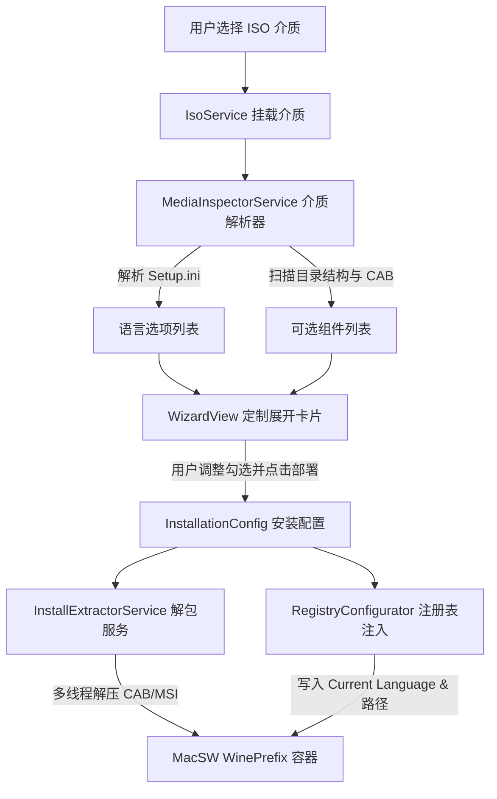

# MacSW 官方介质组件与语言定制提取部署设计规格说明

## 1. 背景与目标

### 1.1 背景问题
SolidWorks 官方安装介质（DVD/ISO）虽然核心运行程序（`SLDWORKS.exe`）自 2016 以来为纯 64 位（x86_64）架构，但其外层引导安装向导（`setup.exe`、`sldim/sldIM.exe`）以及 MSI 内部自解包插件（`ISSetupFilesExtract` / `msi35da.tmp`）依然是古老的 32 位（PE32 x86）程序。
在现代纯 64 位 macOS 环境下，Apple Game Porting Toolkit (GPTK) 移除了 32 位程序启动器支持（未开放 `CX_ALT_LOADER_SOCKET`），导致直接通过 Wine 运行官方 32 位 `setup.exe` 会发生死锁与调用失败。

同时，用户在安装 SolidWorks 时具有强烈的个性化定制需求（例如仅安装核心零件库与中文/英文语言包，避免全部解压导致数十 GB 磁盘浪费）。

### 1.2 核心目标
1. **介质元数据动态读取**：自动解析所选 ISO 介质中的语言包定义（`swwi/data/Setup.ini`）与功能组件目录，不依赖任何写死的静态列表。
2. **原生 UI 定制面板**：在 `MacSW` 部署向导中以原生 macOS 风格呈现语言多选 Chip 与功能组件复选树，并动态计算磁盘预估占用。
3. **极速直接解包部署**：在步骤 3 替换掉脆弱缓慢的 32 位 Windows 官方向导，使用原生多线程解包引擎直接将所选组件与语言释放至 Wine 容器的 `Program Files/SOLIDWORKS/`。
4. **自动化语言注册表激活**：安装完成后，根据用户选择的语言自动写入 Wine 注册表配置，确保 SolidWorks 首次拉起即显示对应语言。

---

## 2. 架构设计与核心组件

### 2.1 模块结构



### 2.2 数据模型定义 (`InstallerModels.swift`)

```swift
struct LanguageOption: Identifiable, Hashable {
    let id: String         // e.g. "0x0804"
    let lcid: String       // e.g. "0x0804"
    let name: String       // e.g. "简体中文 (Simplified Chinese)"
    let cabName: String?   // e.g. "Chinese_Simplified.cab" 或关联 mst
    var isSelected: Bool
}

struct ComponentOption: Identifiable, Hashable {
    let id: String         // e.g. "core", "toolbox", "flow_sim"
    let name: String       // e.g. "SOLIDWORKS 核心主程序"
    let category: ComponentCategory
    let description: String
    let approximateBytes: Int64
    let isRequired: Bool   // 核心主程序必选
    var isSelected: Bool
    let sourceDirs: [String] // 介质中对应的相对目录或 cab 名称
}

enum ComponentCategory: String, CaseIterable {
    case core = "核心设计"
    case simulation = "仿真分析"
    case manufacturing = "制造加工"
    case utilities = "辅助与协作"
}

struct InstallationConfig {
    var selectedLanguages: [LanguageOption]
    var selectedComponents: [ComponentOption]
    var totalEstimatedBytes: Int64 {
        selectedComponents.filter { $0.isSelected }.reduce(0) { $0 + $1.approximateBytes }
    }
}
```

### 2.3 介质检查器 (`MediaInspectorService.swift`)

- **语言检测机制**：
  读取 `${mountPoint}/swwi/data/Setup.ini`。以 UTF-16 / ASCII 读取 `[Languages]` 节区中 `Supported = 0x0804, 0x0409...`。
  映射已知 LCID 编码表：
  - `0x0804`: 简体中文 (Simplified Chinese)
  - `0x0404`: 繁体中文 (Traditional Chinese)
  - `0x0409`: English (英语)
  - `0x0411`: 日本語 (Japanese)
  - `0x0407`: Deutsch (德语)
  - `0x040c`: Français (法语)
  - `0x0412`: 한국어 (韩语)
  默认根据 `Locale.preferredLanguages` 自动勾选匹配项（如优先选中文 + 英文）。

- **组件检测机制**：
  扫描挂载点根目录及 `swwi/data`：
  - `swwi`: 核心主程序（必选，~8 GB）
  - `Toolbox`: 标准件库（Toolbox，~600 MB）
  - `Flow Simulation`: 流体动力学分析（~1.2 GB）
  - `plastics`: 注塑模流分析（~500 MB）
  - `cam`: SOLIDWORKS CAM 编程加工（~800 MB）
  - `visualize`: Visualize 照片级渲染工作室（~1.5 GB）
  - `eDrawings`: 轻量化图纸查看器（~200 MB）
  - `swelectric` / `swComposer` / `SWPDMClient`: 其它扩展工具

### 2.4 用户界面交互 (`WizardView.swift`)

1. 用户在“步骤 1”选取 ISO 介质后，系统在 100ms 内完成挂载与扫描，在介质路径选择器下方展开动画展示 `“定制部署选项”` 区域。
2. **语言 Chip 区**：显示标签胶囊，点击可即时切换选中状态。
3. **组件卡片区**：
   - 核心主程序锁定勾选；
   - Toolbox 默认勾选；
   - 其它模块支持灵活开关；
   - 底部动态更新 `已选择 X 个组件 | 预估空间占用: Y.Y GB`。
4. 勾选项自动与 `AppState.installationConfig` 绑定。

### 2.5 高速解包与部署执行器 (`InstallExtractorService.swift`)

在向导步骤 3（“部署 SolidWorks 核心组件”）启动时：
1. **多线程并发解包**：
   通过 `7z` 命令或内建工具直接提取目标组件的 CAB 与核心文件至 Wine 容器：
   ```bash
   7z x -y -o"${WINEPREFIX}/drive_c/Program Files/SOLIDWORKS Corp/SOLIDWORKS" "${CAB_PATH}"
   ```
2. **Toolbox 零件库定向部署**：
   若勾选 Toolbox，将其数据解包至 `drive_c/SOLIDWORKS Data/`。
3. **语言注册表键值自动注入**：
   执行 Wine 注册表命令写入当前默认语言：
   ```ini
   [HKEY_LOCAL_MACHINE\Software\SolidWorks\SolidWorks 2025\General]
   "Current Language"="Chinese Simplified"
   "Lang"="chinese-simplified"
   ```
4. 整个解压过程通过标准输出行数实时驱动向导界面的百分比进度条（0% -> 100%）。

---

## 3. 错误处理与边缘场景

1. **介质中缺少某些 CAB 文件**：若某组件 CAB 文件损坏或缺失，解包器记录警告并优雅跳过，保证核心主程序正常就位，向导状态标记为带有黄色警告徽标（Warning）。
2. **空间不足防御**：在解包开始前，检查目标 APFS 卷剩余可用空间是否大于 `totalEstimatedBytes * 1.2`；若空间不足，提前阻断并弹出友好提示。
3. **7z 工具可用性**：内置优先检测 `/opt/homebrew/bin/7z`、`/usr/local/bin/7z` 及 App Bundle 内置备用解压工具，保证开箱即用。

---

## 4. 验证与验收标准

1. **测试 ISO 扫描**：挂载 `/Volumes/Solidworks1`，能够正确识别出 14 种语言及 8 个以上独立组件模块。
2. **UI 实时响应**：切换语言 Chip 和组件勾选框时，预估体积与选择状态瞬时刷新无卡顿。
3. **极速解包测试**：执行部署，在 2 分钟内将 SolidWorks 核心程序解包到 `bottle/drive_c/Program Files/SOLIDWORKS/SLDWORKS.exe`。
4. **语言验证**：注册表写入中文标识后，SolidWorks 正确识别并以简体中文加载界面。
